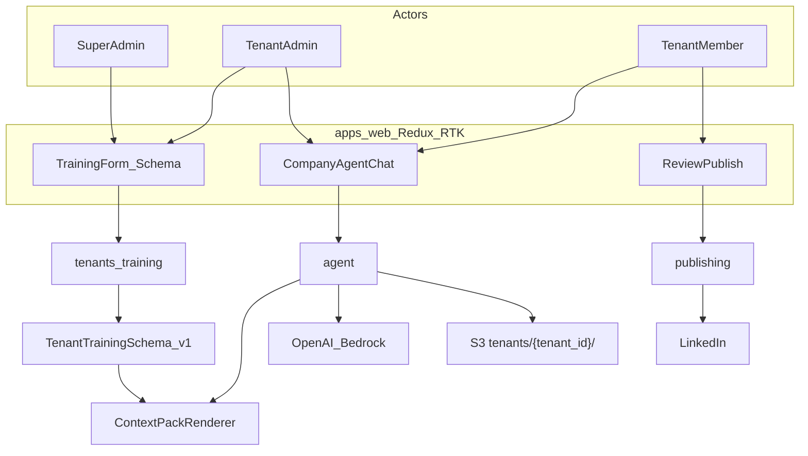

# ContentOS MVP — B2B LinkedIn Image Posts with Structured Tenant Training

## Product north star (MVP)

ContentOS is a **B2B multi-tenant** product: each **company tenant** gets LinkedIn-ready **informative / company-related images + captions**. A formal **company training record** (profile, voice, visuals, facts) is injected on every generation so output stays **on-brand and consistent**. That context is **guidance, not a topic allowlist** — company users may ask the agent for **any** post brief; we do **not** reject requests merely because the topic is absent from training data. **Super admin** (and tenant admin) maintain company records; users chat → **3 variants** → **manual review** → LinkedIn publish.

## Locked decisions
- **Integrations (1B):** Real OpenAI (primary) + Bedrock fallback; real LinkedIn OAuth + image `ugcPosts`.
- **Frontend (2A):** React 18 + TypeScript + Vite + **shadcn/ui + Tailwind** + **Redux Toolkit + RTK Query** + Framer Motion.
- **Auth (v1):** CloudArc JWT. Roles: `super_admin` | `tenant_admin` | `tenant_member`.
- **DB:** Local + QA → Supabase Postgres (SSL). Prod → RDS via CDK.
- **Training format:** Versioned JSON schema (`TenantTrainingSchema` v1) → deterministic markdown **context pack** on every LLM/image call.
- **Chat:** Open-ended — tenant users ask for whatever LinkedIn image post they need; agent always applies company context for voice/brand/known facts.
- **Context role:** Company records keep generation **consistent** (name, tone, colors, known offerings). Prefer using recorded facts when stating company-specific claims; for topics outside the record, still generate creatively in brand voice — **never hard-reject** for “not in context.”
- **UI theming:** Dual mode — (1) **Tenant white-label** only when super-admin has configured a complete brand theme (logo + colors); (2) otherwise **always default to ContentOS platform theme**. Both support **light + dark**. Motion via **Framer Motion**.
- **UI kit:** **shadcn/ui + Tailwind CSS + Radix** (own the components, CSS-variable theming, low boilerplate vs Ant/MUI for white-label). Not locked to glassmorphism — premium modern SaaS aesthetic (see design system).

## Target monorepo layout

```text
ContentOS/
├── Docs/
├── apps/
│   ├── api/
│   └── web/                 # Redux Toolkit + RTK Query
├── infra/                   # MOVE apps/cdk → infra/
├── package.json
└── README.md
```

## Architecture



## Formal training format (consistency)

All training input is validated against **`TenantTrainingSchema` v1** (Pydantic on API + TypeScript type on web). Freeform dumps are not accepted as the primary feed — they go into typed sections only.

### Schema sections (required structure)

```text
TenantTrainingSchema v1
├── meta: schema_version, updated_at, updated_by
├── company
│   ├── legal_name, display_name, industry, website
│   ├── hq_location, operating_regions[]
│   ├── company_size_band, founded_year
│   └── one_liner (max 160 chars)
├── audience
│   ├── icp_titles[], icp_industries[], buyer_pain_points[]
│   └── linkedin_audience_notes
├── offerings
│   └── items[]: name, description, differentiators[], proof_points[]  # facts only
├── messaging
│   ├── tone[], voice_dos[], voice_donts[]
│   ├── banned_claims[], compliance_notes
│   ├── cta_styles[], hashtag_policy
│   └── linkedin_post_length_preference
├── brand_visual
│   ├── primary_color, secondary_color, accent_color
│   ├── logo_url, visual_style_keywords[]
│   └── image_do_nots[]   # e.g. no fake UI text, no competitor logos
├── approved_facts[]       # preferred company facts when relevant
├── faq[]                  # optional Q/A for consistency
└── documents[]            # optional extras: title, category, body, priority
    categories: product | case_study | guideline | other
```

### Context pack renderer
- Single function `build_context_pack(tenant_id) -> str` renders schema → **fixed markdown template** (same section headers every time) so the model always sees consistent structure.
- Token budget (~6–8k chars): drop lowest-priority `documents` first; never drop `company`, `messaging`, `brand_visual`.
- Cache rendered pack on tenant (`context_pack_cached`, `context_pack_version`) invalidated on any training update.
- `GET .../training/preview` returns both raw JSON schema and rendered pack for QA.

### Training UI
- Sectioned form matching schema (not a blank textarea as the main UX).
- Document list as secondary add-ons with category + priority.
- Validation errors from API Zod/Pydantic mapped field-by-field.
- Super admin: `/admin/tenants/:id/training`. Tenant admin: `/settings/training` (same schema, own tenant only).

## Data segregation and security

| Control | Implementation |
|---------|----------------|
| Query isolation | Repositories always filter `tenant_id` from JWT; super admin must pass explicit `tenantId` + audit. |
| RBAC | `super_admin`: all tenants. `tenant_admin`: train + chat + review + LinkedIn. `tenant_member`: chat + review + publish (no training edit). |
| S3 | Keys `tenants/{tenant_id}/posts/...` |
| Secrets | LinkedIn tokens `/{APP}/{env}/linkedin/{tenant_id}` |
| Prompt | Pack from one tenant only; never merge tenants. |
| Audit | Train/save, rebuild pack, approve, publish. |

## How company context is used (important)

| Does | Does not |
|------|----------|
| Inject company name, ICP, tone, colors, offerings, voice rules into every generation | Act as a topic whitelist |
| Prefer recorded facts when the post mentions the company | Reject chat requests outside the training corpus |
| Keep captions/images visually and verbally consistent across posts | Block creative / seasonal / thought-leadership topics the user invents |
| Soft preference: avoid contradicting `banned_claims` / `voice_donts` | Refuse generation when a topic is missing from records |

**System prompt stance:** “Use COMPANY CONTEXT for brand consistency. Fulfill the user’s request even if the topic is not listed in context. Do not invent false company metrics, clients, or awards; for those, stay generic or ask a clarifying question in chat — but still help generate the post assets when asked.”

## Tenant company chat (required)

Company users (`tenant_admin`, `tenant_member`) use **`/agent`** chat to:
- Ask for **any** LinkedIn image-post idea (campaign, event, hiring, product, industry take, etc.).
- Iterate in natural language; agent applies company context automatically for consistency.
- Trigger generation → **3 image + caption variants** (educational / thought_leadership / product_value).

Chat is always scoped to JWT `tenantId`. Session history stored per tenant. Generation always reloads latest context pack so brand/voice stay consistent; **user intent drives the topic**, context shapes how it sounds and looks.

## Backend modules

1. **platform** — login/refresh; register; role seed.
2. **tenants** — CRUD companies; `PUT` training schema (validate); docs CRUD; rebuild/preview pack; theme (subset of `brand_visual`).
3. **agent** — `POST /api/agent/chat`, `POST /api/agent/generate`; **open-ended** user briefs + company context pack for consistency (not a reject gate); 3 variants → S3.
4. **publishing** — LinkedIn OAuth; review gate; publish if `approved`.

### Image pipeline
1. Accept user brief (**any topic**) + load company context pack for `tenant_id`.
2. LLM produces 3 LinkedIn captions + image prompts from **user brief + pack** (pack shapes brand/voice; brief drives topic).
3. Image API → tenant S3 prefix.
4. Return batch for selection → review → publish.

## Frontend (`apps/web`) — Redux Toolkit + RTK Query

**Stack:** React 18, TS, Vite, **Tailwind CSS**, **shadcn/ui** (Radix primitives), React Router, **@reduxjs/toolkit** + RTK Query, **framer-motion**, CSS variables theme engine.

**Why shadcn over Ant Design / MUI:** copy-in components we own; first-class CSS variables for light/dark and tenant remapping; less theme-override boilerplate than Ant/MUI token systems; excellent accessibility via Radix; pairs cleanly with Framer Motion.

**Clean structure:**

```text
apps/web/src/
├── app/
│   ├── store.ts
│   ├── hooks.ts
│   ├── router.tsx
│   └── theme/                 # ThemeProvider, resolveTheme, applyCssVars, dark toggle
├── components/ui/             # shadcn primitives (button, input, dialog, sheet, …)
├── features/
│   ├── auth/
│   ├── tenants/
│   ├── training/
│   ├── agent/
│   ├── posts/
│   └── social/
├── shared/
│   ├── layout/                # AppShell, Sidebar, TopBar
│   ├── motion/                # Framer variants
│   ├── lib/apiBase.ts
│   └── types/
└── main.tsx
```

**Conventions:**
- RTK Query hooks only in views; typed store hooks.
- Feature folders own screens + API slices; thin pages.
- All colors via CSS variables / Tailwind semantic tokens (`bg-background`, `text-primary`, …) — **no hard-coded brand hex in feature screens**.

### Dual UI design system

Docs (PRD §8) define modules/routes, not visuals. MVP visual language:

#### Mode A — ContentOS platform theme (DEFAULT)
Used for: demos, TechPotato use, super-admin sessions, and **any tenant that has not defined UI theming**.

Premium modern SaaS look (market-best fit for this product — not glass-only):
- Refined **soft-surface / elevated panel** system: subtle depth, hairline borders, quiet gradients or mesh atmosphere in the shell background.
- Optional light translucency on nav/modals where it helps hierarchy (selective, not full-page glass clutter).
- Palette: ink/slate neutrals + a confident accent (teal/cyan or similar — avoid generic purple-on-white).
- Typography: distinctive display + clean body (not Inter/Roboto/Arial-only).
- **Framer Motion:** page transitions, staggered lists, dialogs, chat bubbles, 3-variant card reveal — intentional, not noisy.
- Full modern UX: focus rings, keyboard nav, skeletons, empty states, toasts.
- Desktop-first shell (sidebar + top bar), responsive on mobile.

#### Mode B — Tenant white-label (only when configured)
- Super admin sets complete brand: **logo**, **primary/secondary/accent**, optional favicon, `app_display_name`, `ui_mode=white_label`.
- **Incomplete or missing theme → Mode A (platform default).** Never leave an unstyled half-branded UI.
- Same shadcn components; remap CSS variables + logo at login/tenant switch.
- Dark mode for white-label: derive luminance-safe surfaces from brand colors.

#### Light + dark
- `class="dark"` on `<html>`; preference in localStorage (+ optional user setting).
- Toggle in shell header for both modes.

#### Theme resolution order
1. Tenant has complete white-label config (`ui_mode=white_label` + required colors/logo) → Mode B.
2. **Else → Mode A ContentOS platform theme** (explicit default).
3. Apply light/dark from user preference.
4. Super-admin “Preview as tenant UI” only when that tenant’s theme is complete; otherwise preview shows platform theme.

### Backend support for theming
- `brand_visual` / tenant: `logo_url`, colors, `app_display_name`, `ui_mode` (`platform` | `white_label`).
- `GET /api/tenants/me/theme` returns resolved theme (`source: platform | tenant`) for SPA bootstrap.
- Validation: setting `white_label` without required fields rejected or coerced to `platform`.

Routes: login, admin tenants + training (incl. brand/UI), settings/training, agent, review, LinkedIn, publish.

## Env / Supabase

| Env | DB |
|-----|-----|
| local | Supabase SSL |
| QA | Same Supabase (Secrets Manager) |
| prod | RDS |

`APP_NAME=contentos`; never commit DB passwords.

## CDK (`infra/`)

New Lambdas, S3, Secrets; higher timeout/memory for agent; static site + CORS; RDS prod only.

## Implementation order
1. Monorepo restructure + branding + Supabase SSL.
2. Models, RBAC, isolation helpers, audit.
3. `TenantTrainingSchema` + pack renderer + training APIs.
4. Design system shell (shadcn + Mode A premium platform theme + dark/light + Framer) + theme API.
5. White-label tokens only when tenant theme complete; else platform default.
6. Agent chat + 3 image variants + review/publish + LinkedIn.
7. CDK wire-up.

## Out of scope (MVP)
Other networks, Cognito, video, newsletter, vector RAG, analytics, Sandcastles, full PRD module set beyond MVP routes.
