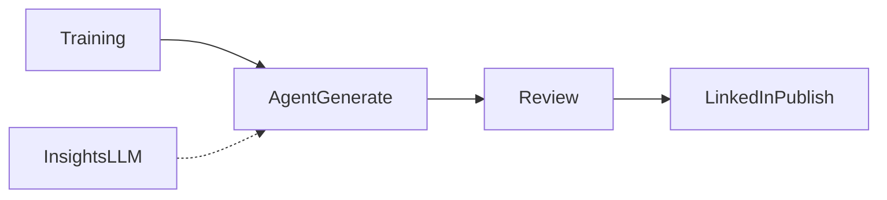
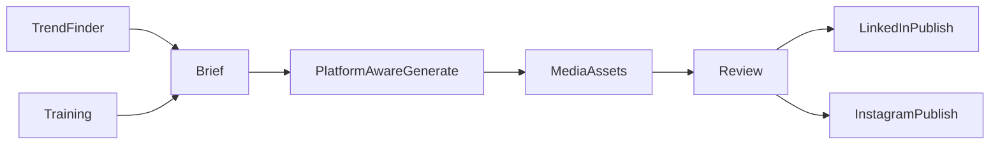
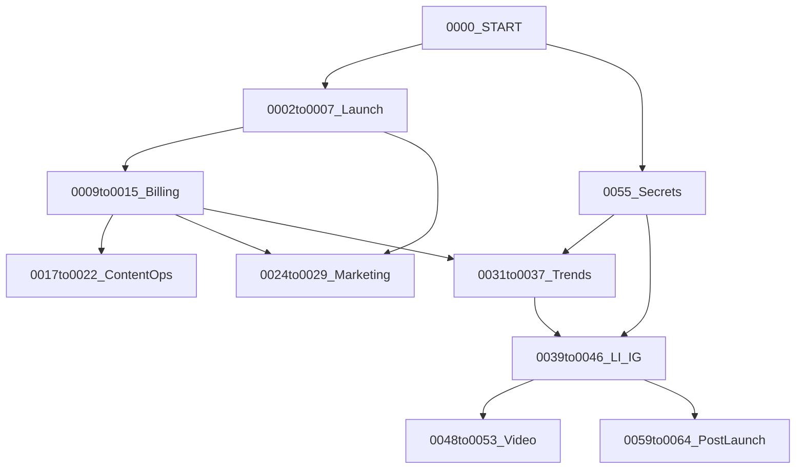

# Multi-modal + Viral Trends Roadmap (LinkedIn + Instagram)

## Where we are

ContentOS today is LinkedIn-only: brand context pack → sync generate (`text` | `image` | `carousel`) → review → LinkedIn publish. Insights are LLM ideation from training data, not live trends. Schema already allows other platforms on [`SocialAccount.platform`](apps/api/layers/shared/python/src/database/models.py) but publish code hardcodes LinkedIn.



## Target end state



**Platforms in scope:** LinkedIn (keep) + Instagram (Business/Creator via Meta Graph API).  
**Modalities:** Phase 1–2 stay image/text/carousel; Phase 3 adds short video (Reels + LinkedIn video) then audio/voiceover.

---

## Phase 1 — Viral trend finder (foundation)

**Goal:** Replace placeholder “insights” with real, brand-filtered trend signals that can seed generation.

### Product behavior
- Discover trends in the tenant’s industry/audience (from training pack).
- Score each trend: relevance, velocity, brand-fit, risk (banned claims).
- One-click **“Generate from trend”** → prefilled brief into existing `/api/agent/generate`.

### Data model (extend [`models.py`](apps/api/layers/shared/python/src/database/models.py))
- `TrendSignal`: `tenant_id`, `topic`, `summary`, `source` (`news` | `google_trends` | `manual` | `social_hint`), `url`, `velocity_score`, `relevance_score`, `brand_fit_score`, `raw_json`, `expires_at`, `status`
- Optional `TrendWatchQuery`: per-tenant keywords/competitors pulled from training

### Ingestion (practical stack — no Sandcastles dependency)
- Scheduled Lambda (same pattern as [`scheduled_publisher.py`](apps/api/src/lambdas/scheduled_publisher.py)):
  1. Pull signals: Google Trends (`pytrends` or SerpAPI), industry RSS/news API (e.g. NewsAPI / GDELT), optional curated URL list
  2. LLM rank/filter against context pack (reuse [`providers.py`](apps/api/modules/agent/src/providers.py) scoring patterns)
  3. Upsert `TrendSignal` rows; expire stale ones
- Manual “add URL / topic” for operators

### API + UI
- New routes under `/api/agent/trends` (or `/api/research/trends`): list, refresh, detail, `POST .../generate` (calls existing generate with trend brief)
- Upgrade [`InsightsPage`](apps/web/src/features/insights/InsightsPage.tsx): live trend cards replace AI-only news; keep suggestions as secondary
- Wire [`contentApi.ts`](apps/web/src/features/api/contentApi.ts)

### Effort
~3–5 weeks (1 backend + 1 frontend overlapping)

---

## Phase 2 — Platform-aware generation + Instagram publish

**Goal:** One brief → LinkedIn + Instagram variants; connect Instagram and publish through the same review gate.

### Schema / publish model changes
- Generalize LinkedIn-specific fields on `ContentPost`:
  - Add `target_platform` (`linkedin` | `instagram`)
  - Add `external_post_id` (migrate `linkedin_post_id` → this, keep alias during transition)
  - Add `parent_post_id` or `campaign_id` so LI + IG variants share a batch/family
  - Media: keep `image_url` / `image_s3_key`; add `media_json` for multi-asset (carousel slides, later video)
- `SocialAccount`: use `platform="instagram"`, `account_kind` = `business` (IG user linked to FB Page). Unique constraint already supports this.

### Generation changes
- Extend generate request: `platforms: ["linkedin","instagram"]` (default LinkedIn-only for backward compat)
- Platform adapters in agent layer:
  - Caption rules (LI length/hashtags vs IG caption + first-line hook)
  - Aspect ratios: LI ~1200×627 / square; IG feed **1:1** and **4:5**, carousel same
  - Extend [`compose.py`](apps/api/modules/agent/src/compose.py) + [`post_schema.py`](apps/api/modules/agent/src/post_schema.py) with platform presets
- Persist one `ContentPost` per platform (same `batch_id`)

### Instagram integration (Meta)
- New OAuth flow beside LinkedIn in [`publishing_controller.py`](apps/api/modules/publishing/src/controllers/publishing_controller.py):
  - Meta app: Instagram Graph API + Facebook Login
  - Scopes: `instagram_basic`, `instagram_content_publish`, `pages_show_list`, `pages_read_engagement`
  - Require IG Professional account linked to a Facebook Page
- Publish adapters:
  - Image / carousel via container → publish media endpoints
  - Reels deferred to Phase 3
- Extend scheduled publisher to dispatch by `target_platform`
- UI: Connections page for Instagram; Agent platform toggles; Review shows platform badge

### Effort
~5–8 weeks (OAuth + Meta app review is often the long pole)

---

## Phase 3 — True multi-modal (video, then audio)

**Goal:** Short-form video for Instagram Reels (+ LinkedIn video), then optional voiceover.

### Prerequisites (do early in this phase)
- **Async job queue**: generation can no longer be sync HTTP. Add SQS + worker Lambda (or Step Functions) with job status on `GenerationBatch` (`queued` | `running` | `completed` | `failed`)
- Media asset table: `MediaAsset` (`type`: image|video|audio, s3 key, duration, aspect ratio, provider job id)

### Video pipeline (committed approach)
1. LLM script + shot list from brief/trend (platform-specific length: ~15–30s Reels)
2. Visuals: image sequence / template slides (reuse compose) **or** one video model provider (start with one: OpenAI Sora API if available, else Runway/Luma via HTTP — pick one vendor and wrap like [`image_providers.py`](apps/api/modules/agent/src/image_providers.py))
3. Assemble with ffmpeg (Lambda layer or ECS task for longer jobs)
4. Captions burned optional; store MP4 in S3
5. Publish: IG Reels container; LinkedIn video UGC

### Audio (follow-on)
- TTS provider adapter (ElevenLabs or OpenAI TTS) for voiceover tracks attached to video
- Standalone audio posts out of scope for LI+IG v1

### Effort
~8–12 weeks after Phase 2 (ffmpeg + async infra + one video vendor + IG Reels)

---

## Cross-cutting work (all phases)

| Area | Work |
|------|------|
| **Review gate** | Keep approve/reject; show platform + modality; block publish if account disconnected |
| **Billing / cost** | Trend refresh + video are expensive — meter usage (align with [`FEATURE-HYBRID-AI-BILLING.md`](apps/docs/FEATURE-HYBRID-AI-BILLING.md)) |
| **Secrets** | Meta + trend API keys in Secrets Manager / `.env` like LinkedIn |
| **Analytics** | After IG publish, replace `PLACEHOLDER_METRICS` with Graph insights + LinkedIn analytics (can trail Phase 2) |
| **Migrations** | Introduce real Alembic versions before large schema changes |

---

## Suggested delivery order (locked)

| Phase | Outcome | Rough calendar |
|-------|---------|----------------|
| **1** | Viral trend finder + generate-from-trend | ~1 month |
| **2** | Instagram connect/publish + LI/IG dual variants | ~1.5–2 months |
| **3** | Async video (Reels + LI video) + TTS voiceover | ~2–3 months |

**Total:** ~4.5–6 months for one strong eng pair; Meta app review and video vendor choice can slip Phase 2–3 independently.

---

## Linear project & ticket numbering (v2 — continuous)

**Target workspace:** [techpotato-2 / TEC](https://linear.app/techpotato-2/team/TEC/overview)  
*(MCP must be connected to this workspace — not `techpotatosoftwares`, which is at free-tier issue limit.)*

**Numbering rule:** Continuous `NNNN` from **0000**. Sort assignable tickets by title ascending. Epics use the first number of their phase block.

### Continuous sequence map

| New # | Old # | Title |
| -- | -- | -- |
| **0000** | 0000 | START HERE — ContentOS build order |
| **0001** | 0050 | EPIC · Phase 0A — Launch Foundation |
| 0002 | 0051 | Harden self-serve signup + tenant provisioning |
| 0003 | 0052 | Email verification + password reset |
| 0004 | 0053 | Team invite links |
| 0005 | 0054 | Guided onboarding wizard (LI → train → generate → review) |
| 0006 | 0055 | Production auth hygiene |
| 0007 | 0056 | LinkedIn publish launch checklist |
| **0008** | 0060 | EPIC · Phase 0B — Billing & Payments |
| 0009 | 0061 | Tenant billing fields + PLAN_CATALOG + AiUsageEvent |
| 0010 | 0062 | resolve_ai_credentials + quota on generate/chat |
| 0011 | 0063 | Stripe Checkout + Customer Portal + webhooks |
| 0012 | 0064 | AI & billing Settings UI |
| 0013 | 0065 | Platform AI Secrets Manager + CDK |
| 0014 | 0066 | Razorpay India (INR/UPI) |
| 0015 | 0067 | Overage / soft-limit UX + upgrade CTAs |
| **0016** | 0070 | EPIC · Phase 0C — Content Ops & Quality |
| 0017 | 0071 | Visual content calendar / schedule queue UI |
| 0018 | 0072 | Image quality — template overlay default + OCR retry |
| 0019 | 0073 | Structured caption validator + banned-claims gate |
| 0020 | 0074 | Audit log UI + enforce writes |
| 0021 | 0075 | Team roles: Reviewer vs Publisher |
| 0022 | 0076 | Bulk generate / CSV brief import |
| **0023** | 0080 | EPIC · Phase 0D — Marketing & GTM |
| 0024 | 0081 | Replace marketing placeholder with landing |
| 0025 | 0082 | Pricing page (Starter/Growth/Scale/Agency) |
| 0026 | 0083 | Waitlist / Founding Member capture |
| 0027 | 0084 | Demo / sales sandbox tenant |
| 0028 | 0085 | Product Hunt / public launch checklist |
| 0029 | 0086 | In-app empty states for create→review→publish |
| **0030** | 0100 | EPIC · Phase 1 — Viral Trend Finder |
| 0031 | 0101 | Alembic migrations foundation |
| 0032 | 0102 | TrendSignal + TrendWatchQuery models |
| 0033 | 0103 | Trend ingest Lambda (news + Google Trends) |
| 0034 | 0104 | LLM brand-fit / velocity scoring |
| 0035 | 0105 | Trends API |
| 0036 | 0106 | Insights UI — live trend cards |
| 0037 | 0107 | Generate from trend → agent pipeline |
| **0038** | 0200 | EPIC · Phase 2 — LinkedIn + Instagram |
| 0039 | 0201 | ContentPost schema: target_platform, external_post_id, media_json |
| 0040 | 0202 | Platform presets in compose + post_schema |
| 0041 | 0203 | Dual-platform generate (LI + IG) |
| 0042 | 0204 | Meta OAuth — Instagram Business connect |
| 0043 | 0205 | Instagram image + carousel publish |
| 0044 | 0206 | Scheduled publisher multi-platform dispatch |
| 0045 | 0207 | UI: Connections + Agent toggles + Review badges |
| 0046 | 0208 | Analytics: LI + IG Graph insights |
| **0047** | 0300 | EPIC · Phase 3 — Video + Audio |
| 0048 | 0301 | Async SQS generation jobs + batch status |
| 0049 | 0302 | MediaAsset model + S3 media pipeline |
| 0050 | 0303 | Video script/shot-list + video provider |
| 0051 | 0304 | ffmpeg assemble short-form MP4 |
| 0052 | 0305 | Publish IG Reels + LinkedIn video |
| 0053 | 0306 | TTS voiceover adapter |
| **0054** | 0400 | EPIC · Cross-cutting |
| 0055 | 0401 | Secrets & env for Meta + trend (+ video/TTS) |
| 0056 | 0402 | Usage metering for trends + video |
| 0057 | 0403 | Review gate: platform/modality publish guards |
| **0058** | 0090 | EPIC · Phase 4+ — Post-launch PRD |
| 0059 | 0091 | Newsletter + blog generation |
| 0060 | 0092 | Extra socials (TikTok, YouTube, X, FB, Pinterest, Threads) |
| 0061 | 0093 | Cognito / SSO migration |
| 0062 | 0094 | Public REST API + webhooks + Zapier |
| 0063 | 0095 | Brand voice AI from writing samples |
| 0064 | 0096 | Admin ops console |
| **0065** | — | EPIC · Native AI Pipeline (LangGraph + RAG + Harness) |
| 0066 | — | Embeddings + pgvector ingest |
| 0067 | — | RAG retrieve for generate/chat/insights |
| 0068 | — | LangChain provider wrappers (OpenAI/Gemini/Bedrock) |
| 0069 | — | LangGraph generate graph |
| 0070 | — | Agent harness tools + tracing |
| 0071 | — | Prompt eval harness + golden fixtures |
| 0072 | — | Streaming / async generate progress |
| **0073** | — | EPIC · Full PRD Vision Gaps (Phase 5–6) |
| 0074 | — | Sandcastles/URL viral analyzer + hook extraction |
| 0075 | — | Competitor monitoring + hashtag/audio trends |
| 0076 | — | Multi-provider images + variants/upscale/bg-remove |
| 0077 | — | AI avatar + photo-to-video (HeyGen/Synthesia/D-ID) |
| 0078 | — | Auto-clipping + subtitles + slideshow video |
| 0079 | — | IG Stories + multi-account per platform |
| 0080 | — | Smart scheduling + recurring + alt-text |
| 0081 | — | One-click content repurposing engine |
| 0082 | — | Viral probability score pre-publish |
| 0083 | — | AI Creative Director + predictive calendar |
| 0084 | — | Email subscriber mgmt + newsletter analytics/A-B |
| 0085 | — | Unified analytics ROI + white-label reports |
| 0086 | — | Sponsorship/brand-deal OS + affiliate tracking |
| 0087 | — | Multi-language content (Hindi+) |
| 0088 | — | Agency white-label + multi-client workspaces |
| 0089 | — | AI A/B testing engine captions/images |
| 0090 | — | React Native mobile app |
| 0091 | — | Creator affiliate program 30% + payouts |
| 0092 | — | Brand kit + template library |
| 0093 | — | Creator marketplace (Phase 6 future) |

### RequirementDocs coverage audit (2026-09-04)

Audited: `ContentOS_PRD_v1_CONSOLIDATED`, `ContentOS_PRR_COMPREHENSIVE` (52 features), `ContentOS_Image_Agent_Improvement_Plan`, Master Index.

| PRD area | Coverage |
| --- | --- |
| Launch / auth / billing / GTM | `0002–0029` |
| Native AI (RAG/LangGraph/harness) | `0065–0072` |
| Trends (practical) + Sandcastles depth | `0031–0037` + `0074–0075` |
| LI + IG publish | `0038–0046` |
| Video basics + avatars/clips | `0047–0053` + `0077–0078` |
| Newsletter 8 platforms / email ops | `0059` (expanded) + `0084` |
| Extra 6 socials | `0060` (expanded) + `0079` |
| Innovations (Creative Director, viral score, repurpose, A/B, languages) | `0081–0083`, `0087`, `0089` |
| Analytics ROI / monetization / agency WL | `0085–0086`, `0088` |
| Mobile / affiliate GTM / templates / marketplace | `0090–0093` |
| Brand voice | `0063` (expanded to PRD §5.4) |

**Already shipped in repo (not re-ticketed):** monorepo, RBAC, training pack, agent text/image/carousel, LinkedIn OAuth+publish, review gate, schedule Lambda, white-label theme basics, register/login UI.

**Intentionally coarse:** each PRR line-item is not 1:1 — e.g. Midjourney+Stability+Leonardo share `0076`; 8 newsletter platforms share `0059`. Large leaves will split during implementation.

**Not product tickets:** GTM ops (Discord community, press outreach, paid ads budget), financial projections, SCORM/LMS (HeyGen enterprise-only defer).

### Strict dependency order (new numbers)



```text
0000 START HERE
0002→0007  Launch Foundation
0009→0015  Billing (after 0002; prefer after 0007)
0017→0022  Content ops (after 0010)
0024→0029  Marketing (after 0002; pricing after 0011)
0031→0037  Trends
0039→0046  LinkedIn + Instagram (after 0037)
0048→0053  Video + TTS (after 0041)
0055→0057  Cross-cutting (0055 early parallel OK)
0059→0064  Post-launch (after billing + IG publish)
0066→0072  Native AI (after 0010 + 0031; before/parallel Trends)
```

**Safe parallels:** `0055` secrets beside Launch/Trends; `0042` Meta OAuth once `0039`+`0055` Done; `0068` LangChain wrappers beside `0066` embeddings.

### Workspace action — DONE (techpotato-2)

1. ~~Connect Cursor Linear MCP to techpotato-2~~
2. ~~Project [ContentOS Full Build](https://linear.app/techpotato-2/project/contentos-full-build-eaddd6e4fdc2)~~
3. ~~Tickets `0000`–`0093` created~~ (native AI `0065–0072`; PRD gaps `0073–0093`)
4. Leave old `techpotatosoftwares` ContentOS tickets as archive/reference — **do not dual-assign**.

**START HERE:** [TEC-5](https://linear.app/techpotato-2/issue/TEC-5) · **First assignable:** [TEC-15 / 0002](https://linear.app/techpotato-2/issue/TEC-15) · **PRD gaps epic:** [TEC-78 / 0073](https://linear.app/techpotato-2/issue/TEC-78)

### Legacy note
Earlier tickets on `techpotatosoftwares` used gap numbering (`0051`, `0101`, …). That scheme is **deprecated**. Use this continuous map only.

## First implementation slice (when tickets exist on techpotato-2)

**Product finish path:** start **0002** (signup), then **0009** (billing fields).  
**Multi-modal-only spike:** start **0031** (Alembic).

---

## Launch backlog feature detail (unchanged intent)

### Shipped already (do not re-build)
Monorepo, RBAC, training schema, agent text/image/carousel, LinkedIn OAuth+publish, review gate, schedule API+Lambda, white-label theme, register/login UI (needs hardening).

### Marketing & GTM (0024–0029)
Landing, pricing, waitlist/Founding Member, demo tenant, PH checklist, empty states.

### Post-launch PRD (0059–0064)
Newsletter/blog, extra socials, Cognito/SSO, public API/Zapier, brand-voice AI, admin console.

### Payments source of truth
[`apps/docs/FEATURE-HYBRID-AI-BILLING.md`](apps/docs/FEATURE-HYBRID-AI-BILLING.md) + PRD Razorpay India; map INR↔USD in one catalog (ticket **0014**).

