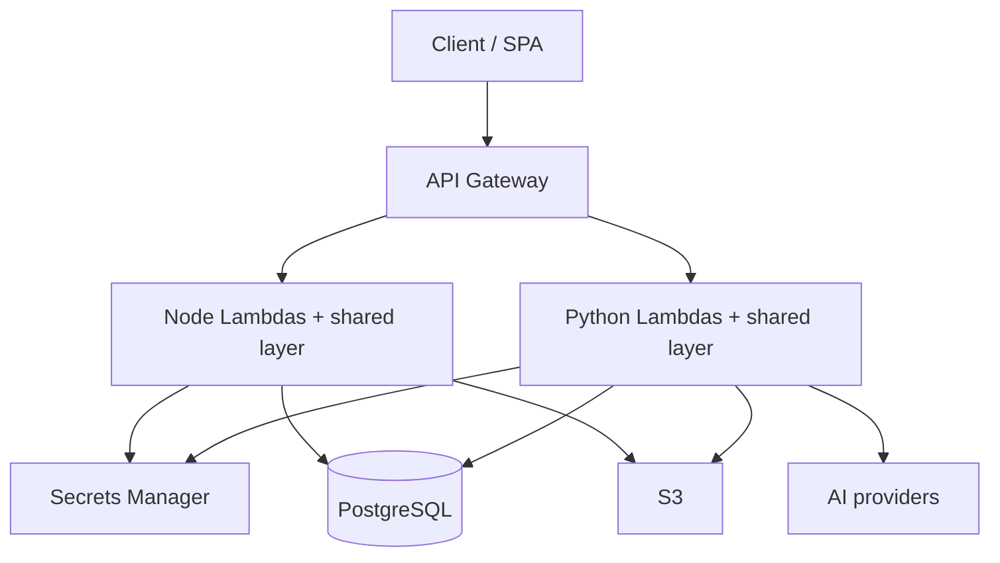

# ArcForge Architecture

## Overview

ArcForge is a modular AWS serverless CloudArc sold as **Node** and **Python** kits with the same architectural shape.

## Request path (both languages)

1. API Gateway invokes a per-module Lambda.
2. Shared layer **handler factory** cold-starts DI/container once, caches router.
3. **Router** matches method/path from decorator registry.
4. Public routes skip JWT (`/api/login`, `/api/auth/refresh`).
5. Authenticated routes: Bearer JWT → `@RequirePermission` → `@RequireModule`.
6. Controller → Service → Repository (CSR).
7. JSON envelope `{ success, data | error }`.

## Shared layer modules

| Concern | Node | Python |
|---------|------|--------|
| Config | `layers/shared/nodejs/src/config` | `layers/shared/python/src/config` |
| DB | Prisma | SQLModel / SQLAlchemy |
| Decorators | reflect-metadata | registry decorators |
| Router / handler factory | `core/` | `core/` |
| Auth / errors | `middleware/` | `middleware/` |
| JWT / secrets / S3 / logger | `utils/` | `utils/` |

See [LAYER-PARITY.md](LAYER-PARITY.md).

## Modules

- **platform** (required) — auth, users, roles, permissions
- **demo** — tutorial CRUD `/api/demo/items`
- **ai** — chat stub / providers

## Deploy

CDK under each kit’s `cdk/` reads `api/app-manifest.json` to wire API Gateway routes to handlers.

- Node kit: TypeScript CDK (`node-cloud-arc/cdk`)
- Python kit: **Python CDK** (`python-cloud-arc/cdk`, `aws-cdk-lib`)

## Local DX

- Node: Express `node-cloud-arc/api/src/dev-server.ts` → port 4000
- Python: FastAPI `python-cloud-arc/api/src/dev_server.py` → port 4001
